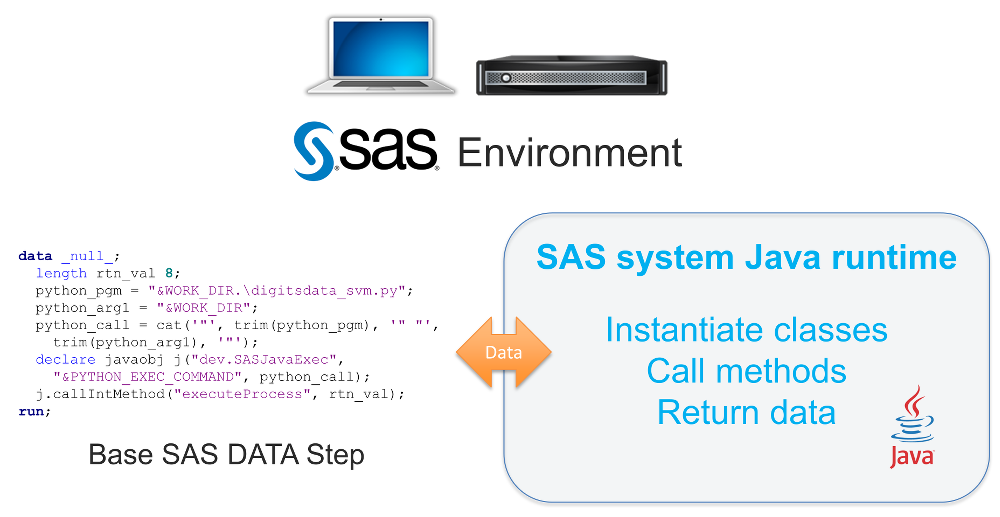
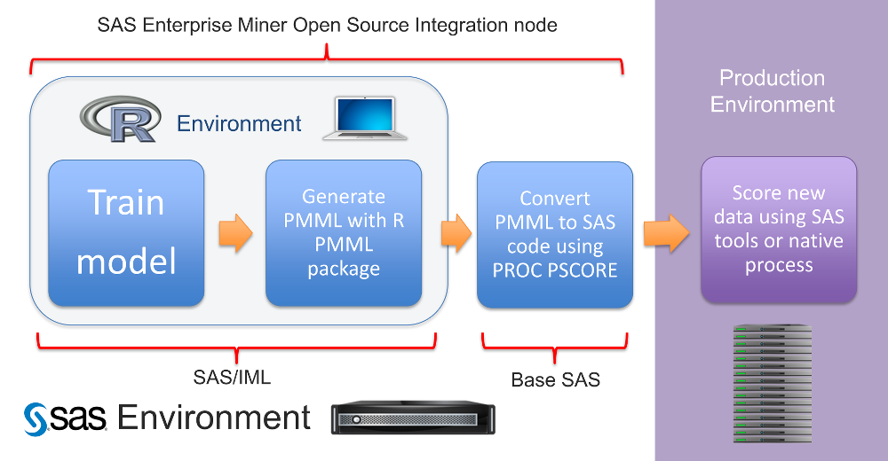

# enlighten-integration

Example code and materials that illustrate techniques for integrating SAS with
popular open source analytics technologies like Python and R.

See individual subdirectories for specific examples and instructions. 

Contributors include:
Patrick Hall, Radhikha Myneni, Ruiwen Zhang, and Tim Haley

## Contents

The example materials in this repository use two approaches to call functionality in other languages from a SAS&reg; session.
* The Base SAS&reg; Java Object
* SAS/IML&reg; Integration with R

### The Base SAS Java Object

The [Base SAS Java Object](http://support.sas.com/documentation/cdl/en/lrcon/68089/HTML/default/viewer.htm#n0swy2q7eouj2fn11g1o28q57v4u.htm) is a SAS DATA step component that enables Java objects to be instantiated, object methods to be called, and results to be returned from Java to SAS. The [SASJavaExec.java](https://github.com/sassoftware/enlighten-integration/blob/master/SAS_Base_OpenSrcIntegration/src/dev/SASJavaExec.java) class in this repository is designed to call executable files from SAS with command line arguments and reports STDOUT and STDERR back to the SAS log. Example materials in this repository use the SASJavaExec.java class to call R and Python scripts, but the class could be used to call other types of executables as well.

#### Using the Base SAS Java Object to call R or Python

[SAS_Base_OpenSrcIntegration](https://github.com/sassoftware/enlighten-integration/tree/master/SAS_Base_OpenSrcIntegration)

* White Paper on [Open Source Integration using the Base SAS Java Object](https://github.com/sassoftware/enlighten-integration/blob/master/SAS_Base_OpenSrcIntegration/SAS_Base_OpenSrcIntegration.pdf)
* White Paper on [Connecting Java to SAS Data Sets](http://support.sas.com/resources/papers/proceedings12/008-2012.pdf)

#### Using Python inside of SAS&reg; Enterprise Miner&trade;

[SAS_EM_PythonIntegration](https://github.com/sassoftware/enlighten-integration/tree/master/SAS_EM_PythonIntegration)

* SAS Communities Tip: [How to execute a Python script in SAS Enterprise Miner](https://communities.sas.com/t5/SAS-Communities-Library/Tip-How-to-execute-a-Python-script-in-SAS-Enterprise-Miner/tac-p/223765)
* Video on [How to Execute a Python Script in SAS Enterprise Miner](http://www.sas.com/apps/webnet/video-sharing.html?player=brightcove&width=640&height=360&autoStart=true&playerID=1873162645001&playerKey=AQ~~,AAABs_kuvqE~,9q03viSCCi8Qu-ec7KH7e-bapzBTKVDB&videoPlayer=4283224315001&emptyPage=false)

### SAS/IML Integration with R

[SAS/IML Integration with R](https://support.sas.com/documentation/cdl/en/imlug/68150/HTML/default/viewer.htm#imlug_r_toc.htm) enables data to be transferred between SAS and R and it enables calling statements from the R language from within a SAS session. One important consideration with R is its ability, much like SAS', to generate [Predictive Modeling Markup Langauge (PMML)](http://dmg.org/pmml/v4-2-1/GeneralStructure.html) to encapsulate the logic of predictive models in a portable format. The example materials in this repository use R to train models and PMML as a portable deployment mechanism. The Enterprise Miner Open Source Integration node is based on the same technologies.

#### Using SAS/IML to call R and create PMML

[SAS_IML_PmmlIntegration](https://github.com/sassoftware/enlighten-integration/tree/master/SAS_IML_PmmlIntegration)

* Video on the [Enterprise Miner Open Source Integration node](http://www.sas.com/apps/webnet/video-sharing.html?player=brightcove&width=640&height=360&autoStart=true&playerID=1873162645001&playerKey=AQ~~,AAABs_kuvqE~,9q03viSCCi8Qu-ec7KH7e-bapzBTKVDB&videoPlayer=3939327608001&emptyPage=false)
* Video on [Calling R from SAS/IML](https://www.youtube.com/watch?v=rUaTTre24kI)

#### Using R to create PMML and importing PMML into SAS Enterprise Miner

[SAS_EM_PmmlIntegration](https://github.com/sassoftware/enlighten-integration/tree/master/SAS_EM_PmmlIntegration)

## Other Integration Approaches

* [SAS Kernel for Jupyter Notebooks](https://github.com/sassoftware/sas_kernel)
* [Calling SAS from R or Python using SAS&reg; BI Web Services](http://blogs.sas.com/content/subconsciousmusings/2015/10/13/how-analytical-web-services-can-help-scale-your-machine-learning/)
* [The LUA Procedure](http://support.sas.com/documentation/cdl/en/proc/68954/HTML/default/viewer.htm#n1csk38ocks0rgn1rr8d302ofqgs.htm)
* [The GROOVY Procedure](http://support.sas.com/documentation/cdl/en/proc/68954/HTML/default/viewer.htm#p1x8agymll9gten1ocziihptcjzj.htm)
* [The JSON Procedure](http://support.sas.com/documentation/cdl/en/proc/68954/HTML/default/viewer.htm#p06hstivs0b3hsn1cb4zclxukkut.htm)